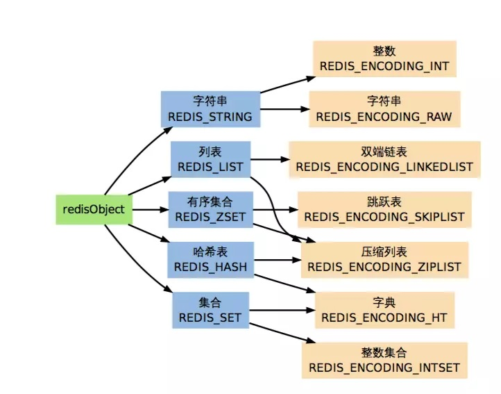
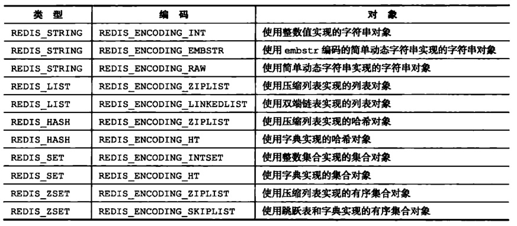

# Java

## 中级开发工程师

### Switch都支持什么类型参数

严格来讲只支持int类型，byte和short因为分别是1个字节和2个字节比int的四个字节短是可以无损转化为int的，char的字符编码是无符号两个字节可以和int无损转化的，Byte,Short,Character,Integer四个包装类可以自动拆箱，Enum枚举存在int类型的ordinal序号，使用序号比较，String类型使用int类型的hashCode比较，特殊点在于hashCode会出现相同的情况所以还会进一步使用equals对比。

### SpingMVC的注解都有什么。

其实很有意思的是@Controller不是Spring MVC的注解，而是Spring框架本身的IoC容器的注解，因为他只是@Component的别名，跟@Service和@Repository一样,@RestController才是Spring MVC的注解。

- 其他的还有@RequestAttribute获取请求的属性值，通常是过滤器拦截器设置的，@RequestHeader请求头里的值，@RequestBody获取POST请求体里面的值，@RequestParam，请求的地址栏参数的值。@RequestPart获取multipart/form-data表单里的值，MultipartFile类型，@CookieValue获取Cookie里的值，@SessionAttribute获取Session里的值，@PathVariable映射url获取对应的值，@MatrixVariable矩阵绑定，映射url对应的矩阵值到map，以上注解都是放在Controller方法的参数里，获取请求信息的。

- @RequestMapping@GetMapping@PostMapping@PutMapping@DeleteMapping@PatchMapping，Controller和方法对应的url地址映射，可指定RequestMethod枚举，可直接用对应的Mapping。

- @ResponseBody指定方法返回对象而不是视图，使用对应注册的HttpMessageConverter转换，@ResponseStatus方法返回指定的httpcode

- @ControllerAdvice@RestControllerAdvice，控制器的通用异常处理，需要配合@ExceptionHandler捕获对应的异常,

- @CrossOrigin跨域处理

- @InitBinder注册数据绑定器，用来处理特殊类型，比如指定日期类型的格式进行转换

- @ModelAttribute处理视图的模型，可在方法的参数中获取值，或在方法上设置值。

- @SessionAttributes在控制器中使用session同步视图的模型数据


### String ,StringBuffer,Stringbuilder 有什么区别

String是字符串常量，StringBuffer是线程安全的字符串变量，StringBuilder是非线程安全的字符串变量，StringBuffer和StringBuilder都继承自AbstractStringBuilder，差别只有StringBuffer在方法上加上了synchronized同步锁关键字，自1.8开始StringBuffer加了个toStringCache，9开始两者的内部存储由char[]改成了byte[]，同时有@HotSpotIntrinsicCandidate注解有jvm直接处理，优化性能。

### String s = new String(“aaa”)，创建几个对象

两个对象，字符串本身就是一个对象，同时new操作不会重用字符串常量池，会强制创建一个对象。同时“a”+“b”形式的字符串常量相加会优化成只有一个对象，但是两个赋值的变量相加会出现三个，而且不会重复使用常量池对象，两个已经初始化过的final字符串相加会重复使用字符串常量池。

### hashmap怎么循环；

HashMap可以循环KeySet，Values和EntrySet，通常遍历EntrySet因为包含KV，然后可以按遍历Set或Collection的方式使用for循环，增强型for循环或者Iterator迭代器遍历，当然如果要删除就只能用迭代器循环对迭代器操作了。

### object都有什么方法；

hashCode哈希值方法，equal判断相等的方法，toString，getClass获取对象实例的运行时类型Class类，clone，wait，notify多线程等待和唤醒

### system.out(++1)，输出结果是什么。

```System.out.print(++1)```这种形式在Java中是语法错误，因为不管是postfix形式的```i++```还是一元运算```++i```都算是值，不算变量。对于```=1;i=++i;System.out.print(i)```,常见jvm结果是2，```i=i++```结果是1，可以解释为```i++```为先赋值在自增，```++i```为先自增再赋值,字节码```i=i++```为先压栈，然后自增，然后出栈，```i=++i```为先自增再压栈再出栈，所以IDE会报无效果的操作。不过由于java只定义了```++/--```的操作，并没有定义自增自减与赋值语句一起时的行为，因此jvm如何处理都是符合语法的，实际开发中不应使用这种未定义的。很久很久以前，```++i```因为是原址自增，```i++```用临时变量，所以```++i```性能稍微好一丢丢，不过现在，这点优化比不过编译器的优化。

## 高级开发工程师

### 如何实现多线程

### 如何创建一个类的实例

1. new
2. 反射 Class.forName找到Class，然后newInstance或者先getConstructor再newInstance
3. 原型模式的clone方法
4. ObjectInputStream反序列化

### Redis的基本数据类型

strings, hashes, lists, sets, sorted sets, bitmaps, hyperloglogs, geospatial indexes, streams

### Mysql和oracle如何分页

MySQL有LIMIT可以分页，数据量大的时候可以加WHERE，ORACLE使用使用row_number()函数或者使用rownum 虚列双层嵌套select查询，PostgreSQL使用LIMIT OFFSET分页，SQL Server使用TOP NOT IN双层嵌套分页或TOP倒序TOP方式或TOP MAX(ID) WHERE方式，2005开始使用TOP ROW_NUMBER() OVER(ORDER BY )双层嵌套，2012开始使用OFFEST FETCH NEXT

### HaspMap的数据类型

HashMap的kv可以为null，不能是基本类型，key的hashCode改变就相当于key改变

### AOP是什么？什么时面向切面编程

Java开发中常用的功能，AOP是OOP的扩展，可以在不改变原有的类的情况下添加功能改变行为，即将功能切入到切入点上。

### Springmvc怎么返回一个json

@Controller上添加@ResponseBody或者改为@RestController,这样就不会返回视图，注册一个JSON的HttpMessageConverter 到Spring MVC中，比如fastjson或者Jackson，Gson，ProtobufJson，或者自定义，通常基于Jackson自定义

### 用过多线程吗，应用场景，多线程都有哪些实现方式

### 都用过哪些框架

### Object都有哪些方法

### 都用过哪些注解

@Component@Controller@Service@Repository@Mapper@Bean@Autowired@Resource@Transactional@override@Scope@Lazy@DepondsOnPostConstructor@PreDestroy@SpringBootApplication@Configuration@ConfigurationProperties@ComponentScan@EnableAutoConfiguration@EnableXXX@Import@ImportResource@PropertySource@Value@Aspect@Pointcut@Before@After@AfterReturning@AfterThrowing@Around以及Spring MVC注解

### 怎么创建一个类的实例

### 怎么遍历一个map

### aop的具体实现方式

jdk动态代理，cglib动态代理，AspectJ静态代理，ASM织入，Javassist 织入

### 强引用  弱引用  虚引用都是什么 有什么区别

java1.2开始分为四种引用类型

1. 强引用 直接创建的对象的引用，不会被GC回收
2. 软引用 通过SoftReference创建的引用，内存不足时会被GC，配合ReferenceQueue ，GC后会被放进队列
3. 弱引用 通过WeakReference创建的引用，GC时会被回收，通常配合Lazy来降低内存占用，配合ReferenceQueue ，GC后会被放进队列
4. 幻象引用 虚引用 通过PhantomReference创建的引用，虚引用完全不影响GC，不能访问对象属性方法，只能用来确定对象有没有被GC，配合ReferenceQueue ，GC后会被放进队列

### 死锁的场景

- 场景：

1. 系统资源的竞争。因为系统的资源不足，不能满足进程的资源请求，会导致多个线程同时争夺一个资源。只有资源不足时才会出现死锁可能，另外，可剥夺资源的竞争是不会引发死锁的；
2. 进程推进顺序不对。多进程在运行时，请求和释放资源的顺序不当。
3. 系统资源分配不当，有的进程分配的资源太少，会因为争夺资源而陷入死锁

- 四大必要条件：

1. 互斥：进程对分配到的资源排它性使用。独占资源，是由资源本身的属性决定的。一个资源一次只能被一个进程使用，当该进程使用这个资源的时候，其他进程就不能使用，具有独占性
2. 请求和保持：保持已有资源，同时请求新的资源，在请求过程中以及因为没有得到新资源而阻塞，已有资源仍然保持。一个进程要请求新的资源，但同时对已获得的资源不释放，要等待其他进程释放资源
3. 不可剥夺：进程已有的资源在使用完之前不能被剥夺，只能自己释放，进程已获得的资源，在未使用完之前，不能被强行剥夺
4. 环路等待：必然存在一个进程资源环形请求链。若干进程都要申请资源，但是都对已获得的资源不释放，都要等待其他进程是否资源，若干进程陷入循环等待资源

- 死锁预防：打破之前四个条件

1. 打破互斥在实际中应用不大，本身加锁就为了资源互斥，互斥不能破坏，所以不能由互斥入手来避免死锁
2. 打破请求与保持，可以实行资源预先分配策略，即进程在运行前一次性申请所需要的全部资源，如果不能满足，则暂不运行。实际应用中，进程在执行时是动态的，不可预测的，并且资源利用率低，降低了进程并发性。请求的时候先把自己的锁释放掉，然后再申请新的锁
3. 打破不可剥夺，当请求新资源不能满足，需要释放已有资源，系统性能受到很大降低。如果别人的锁的优先级比自己的锁的优先级高，则可以抢过来
4. 打破循环等待：实行资源有序分配策略。可以将资源事先分类编号，按号分配，使进程在申请、占用资源是不会形成环路。所有进程对资源的请求必须严格按资源序号递增的顺序提出。但是也有问题，合理编号困难，增大系统开销，另外也增加了进程对资源的占有时间。在申请新锁的时候，先把自己的锁释放，在申请新锁，就不会陷入循环等待中

- 死锁避免：

　　不限制进程有关申请资源的命令，而是对进程所发出的每一个申请资源命令加以动态地检查，并根据检查结果决定是否进行资源分配。就是说，在资源分配过程中若预测有发生死锁的可能性，则加以避免。这种方法的关键是确定资源分配的安全性。

　　银行家算法（1968年）：允许进程动态地申请资源，系统在每次实施资源分配之前，先计算资源分配的安全性，若此次资源分配安全（即资源分配后，系统能按某种顺序来为每个进程分配其所需的资源，直至最大需求，使每个进程都可以顺利地完成），便将资源分配给进程，否则不分配资源，让进程等待。

- 死锁检测与修复：

　　预防和避免的手段达到排除死锁的目的是很困难的。一种简便的方法是系统为进程分配资源时，不采取任何限制性措施，但是提供了检测和解脱死锁的手段：能发现死锁并从死锁状态中恢复出来。因此，在实际的操作系统中往往采用死锁的检测与恢复方法来排除死锁。

- 常见出现死锁的地方
  1. 忘记释放锁
  2. 单线程重复申请锁，有自己的锁，但是还要申请新锁，在申请新锁的时候，因为锁被占用，所以会被挂起等待，但是锁是被自己占用，而自己又被挂起，没机会释放锁，则会进入死锁
  3. 多线程多锁申请，彼此申请对方资源而导致的死锁，A申请B的锁的时候，因为锁被占用所以会把A挂起等待B释放锁，同时B申请A的锁，同样因为A的锁被占用，B会被挂起等待，都被挂起没有机会释放锁，则进入了死锁
  4. 多线程循环所申请
- 编程中如何来避免：

  1. 检查有没有忘记释放锁
  2. 如果自己模块可能重复使用一个锁，建议使用嵌套锁
  3. 建议使用库里面的锁
  4. 如果某项业务需要获取多个锁，保证锁按某种顺序来获取
  5. 编写简单测试用例验证是否存在死锁

## 资深开发工程师

### 多线程的实现方式

### 介绍一下单例模式，写一个枚举类型

1. 定义静态变量并初始化，定义静态方法将静态变量返回，该方式没有延迟加载特性
2. 定义静态内部类，在静态内部类中静态变量并初始化，定义静态方法返回静态内部类的静态变量，利用类加载机制实现延迟加载和线程安全
3. 定义静态变量和静态代码块，在静态代码块中初始化变量，定义静态方法返回静态变量，利用类加载机制实现延迟加载和线程安全。
4. 定义静态变量并且不要初始化，定义静态方法，判断静态变量是否初始化，未初始化则初始化，最后返回。该方式虽然是延迟加载的，但是线程不安全。
5. 给4的静态方法添加synchronized同步锁关键字，延迟加载且线程安全，但是全阻塞。
6. 双重检查锁，判断静态变量是否为空，空则加锁，然后判断为空则初始化，最后返回。延迟加载且线程安全，而且尽量降低了阻塞
7. 使用CAS，定义静态AtomicReference的变量，并且初始化这个引用，使用AtomicReference的get方法获取这个实例，判断是否为空，如果为空则创建一个新实例并使用compareAndSet设置进去，最后返回，缺点是虽然最后返回的是同一个实例，但是可能创建多个实例。
8. 使用单例注册列表，例如HashMap或者ConcurrentHashMap，将单例批量初始化设置进去，使用时获取，即spring框架的做法
9. 枚举方式，可以防御反序列化和反射，但是只能实现自己的单例。readResolve能防御反序列化
10. 

### 介绍一下Hashmap， 常用的数据集合，set和arraylist区别

Set接口和List接口，包括Queue接口都是Iterable的子接口Collection的子接口，所以都是可遍历的，Map本身是个顶级接口，不能遍历，可根据key值获取内容，不能根据下标获取内容。

Set接口不包含重复元素，根据equals方法判断是否重复，可包含最多一个null，接口本身不保证有序，子接口SortedSet定义了有序的Set。具体实现方法都继承了抽象类AbstractSet，HashSet使用哈希表实现（HashMap），LinkedHashSet继承自HashSet，加入了链表，遍历是性能更好，但是插入性能低，TreeSet实现了SortedSet的子接口NavigableSet，所以是有序的可导航的，根据compare() 和 compareTo() 排序

List接口可包含重复元素，可以插入多个null，接口元素的访问顺序就是添加顺序。具体实现中ArrayList和Vector继承了AbstractList抽象类且同时实现了RandomAccess随机访问接口，两者都是动态数组实现的，区别是Vector加了synchronized同步锁，LinkedList继承了AbstractList的子类AbstractSequentialList且同时实现了Queue接口的子接口Deque双端队列，双向链表的实现

Queue接口的子接口和实现大部分是为了并发考虑的，在java.util.concurrent包里，比如BlockingQueue和Deque阻塞队列接口和双端队列接口

Map接口是一个键值对的映射，key不能重复，最多有一个null，每个key只对应一个value，value可以有多个null；实现类中Hashtable继承自Dictionary，Dictionary也只有这么一个子类，方法添加了synchronized同步锁，所以是线程安全的，该方法十分古老，可以注意到类名并不符合要求的帕斯卡命名法，另外Hashtable不允许key值为null在添加时做了判断，初始容量为11，负载因子为0.75，扩容时扩容为2n+1。HashMap继承自AbstractMap，不是线程安全的，初始容量为16，负载因子为0.75，扩容为2n，HashMap的哈希算法经过特殊设计不使用%，而且1.8将扩容算法改为使用无符号移位>>>，要求长度必须是2^n，但是性能高了不少。1.8将实现从数组+链表改为数组+链表+红黑树，大于8的时候会改为红黑树。LinkedHashMap继承自HashMap，维护了一个双向链表保证了读取顺序与插入顺序一致。TreeMap实现了SortedMap接口的子接口NavigableMap，所以是有序的可导航的，根据compare() 和 compareTo() 排序。

如果你经常会使用索引来对容器中的元素进行访问，那么 List 是你的正确的选择。如果你已经知道索引了的话，那么 List 的实现类比如 ArrayList 可以提供更快速的访问,如果经常添加删除元素的，那么肯定要选择LinkedList。
如果你想容器中的元素能够按照它们插入的次序进行有序存储，那么还是 List，因为 List 是一个有序容器，它按照插入顺序进行存储。
如果你想保证插入元素的唯一性，也就是你不想有重复值的出现，那么可以选择一个 Set 的实现类，比如 HashSet、LinkedHashSet 或者 TreeSet。所有 Set 的实现类都遵循了统一约束比如唯一性，而且还提供了额外的特性比如 TreeSet 还是一个 SortedSet，所有存储于 TreeSet 中的元素可以使用 Java 里的 Comparator 或者 Comparable 进行排序。LinkedHashSet 也按照元素的插入顺序对它们进行存储。
如果你以键和值的形式进行数据存储那么 Map 是你正确的选择。你可以根据你的后续需要从 Hashtable、HashMap、TreeMap 中进行选择。

### Redis 数据类型，

### Springmvc方法返回数据格式怎么实现，她是怎么知道要返回数据格式的。

注册的各种HttpMessageConverter 转换的，根据requestHeader里的accept判断的

### SpringMVC实现原理，怎么根据URL找到对应实现方法，为什么能找到

HandlerMapping，初始化的时候将控制器放入IoC容器，然后将映射关系写入HandlerMapping

## 架构师

### Redis新增数据，怎么保证与数据库一致

新增数据先进入数据库，然后插入redis或第一次使用时插入redis，更新数据时使用延迟双删，想删redis，在更新数据库，然后延迟一定时间再删除redis，会有短暂缓存失效。设置缓存过期时间，达到最终一致性。或者开发对应的工具通过解析数据库的事务日志更新redis。要求严格一致的话需要将所有读写操作串行，效率低。


### Mq应用场景

异步解耦，削峰限流，消息通讯分发，分布式事务等类似类型的分布式信息同步

###  多线程怎么实现，

1. 线程池（Executors静态方法（有可能创建过多线程或者堆积大量请求OOM）、ThreadPoolExecutor（更推荐，有不同类型的BlockingQueue）,是否实现ThreadFactory自定义线程工厂）
2. 手动新线程（继承Thread类(直接执行)，实现Runnable接口（放Thread里执行））
3. Callable加上线程池或者手动新线程（需要Future或者FutureTask，1.5）

### Redis保存数据类型

常见strings, hashes, lists, sets, sorted sets,bitmaps，hyperloglogs，geo，streams。



底层数据RealObject结构体（保存类型编码访问时间应引用计数和指向实际内存地址的引用等）

string使用OBJ_ENCODING_RAW（SDS，数据实际存放地址的格式，内存预分配）和OBJ_ENCODING_EMBSTR（3.0开始数据量小于一定值嵌入到realObject，3.0和3.2分别是39，44，凑足64，分配内存时以2的n次幂分配）

OBJ_ENCODING_ZIPLIST（压缩双向链表小于一定值的时候hash，list，zset格式，默认分别是数量512值长度64 大小8K 数量128值长度64）

OBJ_ENCODING_LINKEDLIST 和 OBJ_ENCODING_QUICKLIST（链表格式，3.2改为quicklist）,数量较多时的Slist

REDIS_ENCODING_HT dict字典，基于哈希表，键值映射关系，数据量较大的hash,sets

REDIS_ENCODING_SKIPLIST skiplist，数据量大于一定值时zset使用dict和skiplist

REDIS_ENCODING_INTSET 数量少的时候的sets，有序集合二分查找，默认512




###  读写分离怎么实现，注解是什么，

独立的mycat， ShardingSphere

spring 的AbstractRoutingDataSource，TargetDataSource注解切换，手动实现自定义注解

开源实现的动态数据源dynamic-datasource-spring-boot-starter

###  springmvc的实现机制

ContextLoaderListener 一个用来启动或者结束web应用程序context的监听器 初始化spring mvc的web应用程序的根context，将配置好的bean加载，为servlet准备好环境

DispatcherServlet继承自FrameworkServlet，接管servlet，HTTP请求的控制器或者handler的中心调度器，FrameworkServlet中初始化，以上一个跟context为父容器控制器的context，加载配置好的控制器，DispatcherServlet初始化spring mvc的支持部件，各种Resolver，handler等。

http请求过来，进入DispatcherServlet，查询HandlerMapping找到url对应的handler，然后HandlerAdapter适配器取出Handler本身，处理完成后解析渲染视图，或者解析成json，xml等，最后通过RequestDispatcher调度器返回结果。

### 线上CPU100% 如何排查问题

top查看具体占用资源过多的进程，linux系统可以用pstack，gstack，strace查看进程的栈信息等，java程序可以使用jstack查看栈信息，然后具体处理，java程序如果可能的话可以在启动时配置生成dump文件，然后jvisualvm分析。

### 如何分析dump

查看线程状态，阻塞状态的线程具体情况，锁信息，死锁，方法执行次数多，时间长等

### Redis的缓存如何保证和数据库一致

延迟双删，过期时间，串行读写队列

### Mysql的主从复制如何实现

1.Replication，手动配binlog或者Global Transaction Identifiers，全局事务标记，异步或半同步，事务重放

2.Group Replication，GTID，paxos分布式协议，事务日志传输过程同步，新版本才有

3.InnoDB Cluster， MySQL Shell 、MySQL Router 与Group Replication配合的完整方案，新版本才有

4.NDB Cluster，NDB引擎，SQL Node分发到Data Node，Manager Node管理集群

5.Galera Cluster，第三方，需要修改mysql引擎，加入wsrep功能，mariadb和percona自带patcher，不用修改,MariaDB Galera Cluster,Percona XtraDB Cluster

### Mysql的读写分离  怎么实现

设置主从复制，然后配置MySQL Proxy（被放弃），MySQL Router （新版），mycat（被废弃项目二次开发），ShardingSphere，kinshard,xiaomi Geae等还有像Vitess 只支持分片

TiDB，GreenPlum等newsql

### Mysql主从切换怎么处理

1.手动切换，主库只读，从库读写，修改主从指向，修改连接配置等

2.cluster自动选举

###  SpringCloud 和dubbo区别

spring cloud是微服务，dubbo是RPC，spring cloud是基于servlet容器的http的rest api，dubbo是基于netty的NIO模型的rpc，tcp协议。

springcloud有完整的生态，熔断限流监控追踪等，dubbo只有有限的分布式调度和内置的监控

### 服务器CPU高的时候怎么处理

分析线程dump

###  MYSQL读写分离读节点和写节点怎么区分

主从复制主节点读写，从节点读，shardingjdbc，mycat配置，动态数据源配置

###  MQ消息积压了消费者宕机了怎么办

设置消息队列的消息过期时间，会丢失信息。设置死信处理，可以用其他方法处理，但是依然不是正常处理。

丢失或死信可查询出来重新发往消息队列

扩容消息队列和消费者

## 资深架构师

### 写没写过工厂模式

写过，比如阿里oss，亚马逊s3，minio等多种对象存储可供选择，设计成可配置模式，使用工厂模式。

### 线上程序cpu100%怎么分析问题

### 都有什么设计模式

创建型模式：用于描述“怎样创建对象”，它的主要特点是“将对象的创建与使用分离”。GoF 中提供了单例、原型、工厂方法、抽象工厂、建造者等 5 种创建型模式。

- 单例（Singleton）模式：某个类只能生成一个实例，该类提供了一个全局访问点供外部获取该实例，其拓展是有限多例模式。
- 原型（Prototype）模式：将一个对象作为原型，通过对其进行复制而克隆出多个和原型类似的新实例。
- 工厂方法（Factory Method）模式：定义一个用于创建产品的接口，由子类决定生产什么产品。
- 抽象工厂（AbstractFactory）模式：提供一个创建产品族的接口，其每个子类可以生产一系列相关的产品。
- 建造者（Builder）模式：将一个复杂对象分解成多个相对简单的部分，然后根据不同需要分别创建它们，最后构建成该复杂对象。

结构型模式：用于描述如何将类或对象按某种布局组成更大的结构，GoF 中提供了代理、适配器、桥接、装饰、外观、享元、组合等 7 种结构型模式。

- 代理（Proxy）模式：为某对象提供一种代理以控制对该对象的访问。即客户端通过代理间接地访问该对象，从而限制、增强或修改该对象的一些特性。
- 适配器（Adapter）模式：将一个类的接口转换成客户希望的另外一个接口，使得原本由于接口不兼容而不能一起工作的那些类能一起工作。
- 桥接（Bridge）模式：将抽象与实现分离，使它们可以独立变化。它是用组合关系代替继承关系来实现，从而降低了抽象和实现这两个可变维度的耦合度。
- 装饰（Decorator）模式：动态的给对象增加一些职责，即增加其额外的功能。
- 外观（Facade）模式：为多个复杂的子系统提供一个一致的接口，使这些子系统更加容易被访问。
- 享元（Flyweight）模式：运用共享技术来有效地支持大量细粒度对象的复用。
- 组合（Composite）模式：将对象组合成树状层次结构，使用户对单个对象和组合对象具有一致的访问性。

行为型模式：用于描述类或对象之间怎样相互协作共同完成单个对象都无法单独完成的任务，以及怎样分配职责。GoF 中提供了模板方法、策略、命令、职责链、状态、观察者、中介者、迭代器、访问者、备忘录、解释器等 11 种行为型模式。

- 模板方法（TemplateMethod）模式：定义一个操作中的算法骨架，而将算法的一些步骤延迟到子类中，使得子类可以不改变该算法结构的情况下重定义该算法的某些特定步骤。
- 策略（Strategy）模式：定义了一系列算法，并将每个算法封装起来，使它们可以相互替换，且算法的改变不会影响使用算法的客户。
- 命令（Command）模式：将一个请求封装为一个对象，使发出请求的责任和执行请求的责任分割开。
- 职责链（Chain of Responsibility）模式：把请求从链中的一个对象传到下一个对象，直到请求被响应为止。通过这种方式去除对象之间的耦合。
- 状态（State）模式：允许一个对象在其内部状态发生改变时改变其行为能力。
- 观察者（Observer）模式：多个对象间存在一对多关系，当一个对象发生改变时，把这种改变通知给其他多个对象，从而影响其他对象的行为。
- 中介者（Mediator）模式：定义一个中介对象来简化原有对象之间的交互关系，降低系统中对象间的耦合度，使原有对象之间不必相互了解。
- 迭代器（Iterator）模式：提供一种方法来顺序访问聚合对象中的一系列数据，而不暴露聚合对象的内部表示。
- 访问者（Visitor）模式：在不改变集合元素的前提下，为一个集合中的每个元素提供多种访问方式，即每个元素有多个访问者对象访问。
- 备忘录（Memento）模式：在不破坏封装性的前提下，获取并保存一个对象的内部状态，以便以后恢复它。
- 解释器（Interpreter）模式：提供如何定义语言的文法，以及对语言句子的解释方法，即解释器。

J2EE 模式
这些设计模式特别关注表示层。这些模式是由 Sun Java Center 鉴定的。

- MVC 模式（MVC Pattern）
- 业务代表模式（Business Delegate Pattern）
- 组合实体模式（Composite Entity Pattern）
- 数据访问对象模式（Data Access Object Pattern）
- 前端控制器模式（Front Controller Pattern）
- 拦截过滤器模式（Intercepting Filter Pattern）
- 服务定位器模式（Service Locator Pattern）
- 传输对象模式（Transfer Object Pattern）

### 都用过什么设计模式

单例，工厂方法，抽象工厂，建造者，代理，适配器，策略，职责链，中介者，迭代器

### Tomcat怎么优化

java启动参数，xms，xmx,xmn,xss，G1 cms 

tomcat自身参数，超时时间，请求线程数，处理线程数，静态资源缓存等

### Springcloud和dubbo的

### Redis怎么保持数据一致性

### Mysql怎么优化

server配置参数优化

索引

慢查询

where子句条件优化，走索引

### Mysql读写分离

### 如何保持redis数据和数据库中的数据一致性。

强一致，最终一致


### redis雪崩怎么处理，

设置不一样的过期时间

查看雪崩原因，代码问题缓存穿透且累加，修改代码

内容预加载进redis，扩大集群

缓存穿透 用比较快速的算法判断是否存在，如布隆过滤，或者简单粗暴的把空值也缓存

缓存击穿，加锁，使用redis的SETNX，或单独处理

### mq如何保证不被重复消费。

幂等操作，查询数据库是否处理，主键约束，全局消息ID然后缓存，消息队列本身设置

### Jdk源码相关问题

### 如何实现高并发多线程的控制？如果想控制在2个线程，可以通过什么方式实现

线程池future控制，自定义线程工厂设置，利用ReentrantLock重入锁等，重写线程池策略，利用Semaphore信号旗控制

### 缓存redis主要用在哪些地方，都是怎么用的

### 分布式事务用的什么，目前使用tcc，由于实现比较复杂，基于2阶段提交。后续会使用seata集成

tx-lcn lcn模式代理链接，全程接管 tcc手动二次提交，txc 查询受影响数据保存下来，回滚时恢复，redis分布式锁

seata at模式 全自动二次提交，tcc模式手动二次提交，saga手动前级事务补偿，不成熟，不保证，XA未实现

### Spring cloud与dubbo有什么区别

### Rabbitmq中有几种名词，比如broker

AMQP
broker 节点本身
Queue承载消息的队列
Exchange 接收消息并根据规则发送到指定队列，topic，fanout，direct，header
Binding 根据规则将Queue个Exchange绑定起来
Routing Key Binding Key Exchange根据这俩关键字处理转发
vhost broker中隔离的不同虚拟主机
channel TCP连接中的连接通道
producer：消息生产者，就是投递消息的程序。
consumer：消息消费者，就是接受消息的程序。

JMS
Queue p2p
Topic pub/sub
Session 操作接口
Message 消息本身

kafka
broker 服务器节点
topic 消息的队列
partition topic的存储单元
leader follower partition的主从
segment partition的存储结构
producer：消息生产者，就是投递消息的程序。
consumer：消息消费者，就是接受消息的程序。
consumer group 消费者组，按组处理

nsq
topic消息的队列
channel 消费者组

### Mysql是如何主从复制的，通过binlog日志，通过什么配置的

### Jdk8和jdk7区别

8移除了PermGen永久代空间，改为Metaspace，native存储，不在heap区
添加了lambda和stream，新的日期时间java.time.LocalDateTime
接口可以添加默认方法和静态方法

### 如何停止多线程

在线程中设置停止标记，条件 符合时停止，线程的interrupt线程池的shutdown

### 服务器CPU占用很高，如何处理

### Springboot实现原理

spi,自动配置

### Spring cloud与dubbo有什么区别

### Mysql如何实现主从复制

### Mysql如何实现读写分离

### Jdk8和jdk7区别

### Java 的垃圾回收  回收机制  回收策略

垃圾回收器回收heap堆，JVM内存分为堆区heap，方法区，线程栈区stack，本地方法栈和程序计数器，方法区保存了类型信息和方法列表，没多少内存没有回收的必要，线程栈只保存基础类型和对象的引用，而且随着线程的结束结束，也没有回收的必要

可达性分析，不同jvm实现机制不一样，复制算法，标记-整理算法，标记-清除算法

可达性分析算法有广度优先和深度优先两种

HotSpot有serial单线程分代分new和old，分别是复制算法和标记整理算法；parNew，多线程版serial new；cms并发老年代回收算法，标记清除算法，可开启整理；parallel分代，多线程复制算法和标记整理算法；G1分代分块，低停顿；zgc指针着色和读屏障，极低停顿 ；Shenandoah 分代分块，低停顿

J9有gencon，分代，低停顿；balanced分代，平衡；optavgpause，不分代，低停顿；optthruput，不分代，高吞吐量；metronome，不分代，分块，实时性，RT嵌入式

Zing有C4 GC，延迟极低，回收极快的商业VM，10ms内回收2TB的堆

## 其他

### 设计模式

### 数据库事务管控

### 悲观锁

### 乐观锁

### spring基本原理

### http请求

### session机制

### redis缓存原理

### dubbo机制

### maven

### 版本控制工具svn